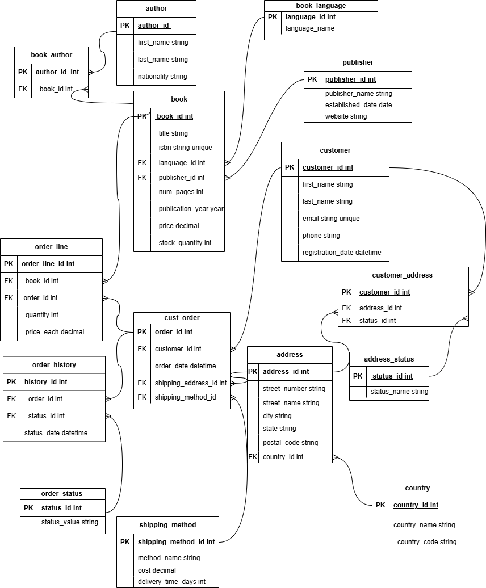

## Bookstore Database Project

#### Overview:  
This project is a database design for a bookstore management system. The database includes tables for books, authors, publishers, customers, orders, and more.

#### Tables:  
The database includes the following tables:

- `book`: stores information about books
- `book_author`: manages the many-to-many relationship between books and authors
- `author`: stores information about authors
- `book_language`: stores information about book languages
- `publisher`: stores information about publishers
- `customer`: stores information about customers
- `customer_address`: stores addresses for customers
- `address_status`: stores statuses for addresses (e.g., current, old)
- `address`: stores information about addresses
- `country`: stores information about countries
- `cust_order`: stores information about orders
- `order_line`: stores information about order lines
- `shipping_method`: stores information about shipping methods
- `order_history`: stores the history of orders
- `order_status`: stores information about order statuses

#### Schema:  
The database schema is designed to capture the key information about books, authors, publishers, customers, and orders. The schema includes primary keys, foreign keys, and relationships between tables to ensure data consistency and integrity.

#### Usage:  
This database can be used to manage a bookstore's inventory, track customers' orders, and analyze sales data.

#### Installation:  
To use this database, you'll need to:

1. Create a new database in your database management system.
2. Run the SQL script to create the tables and relationships.
3. Insert data into the tables using the provided SQL statements.

#### Contributing:  
Contributions are welcome! If you'd like to contribute to this project, please fork the repository and submit a pull request.

